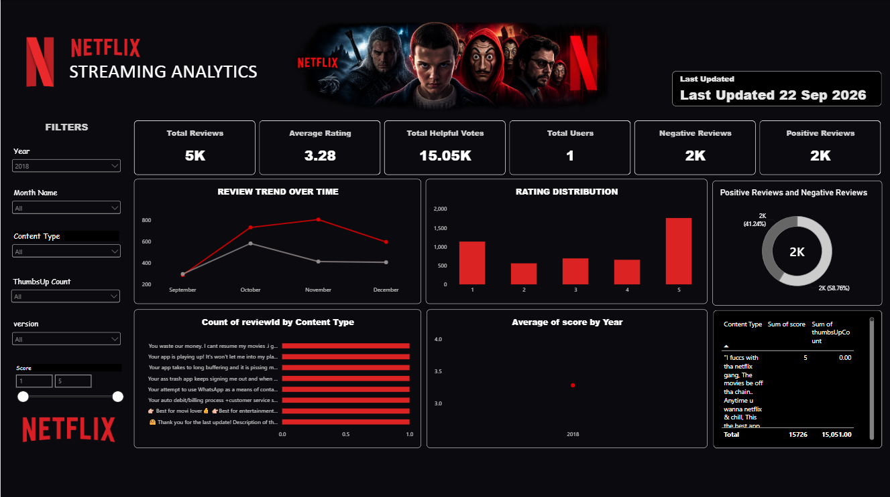

# 📊 Netflix Data Analytics Dashboard

An interactive **Power BI dashboard** designed to analyze Netflix content, ratings, reviews, release trends, and audience engagement.

## 🎯 Project Objective

The goal of this project is to transform Netflix data into meaningful insights using interactive visualizations and data analysis techniques.

## 🛠️ Tools & Technologies

- Power BI
- Power Query
- DAX
- Data Cleaning
- Data Visualization
- Data Analysis

## 📈 Dashboard Analysis

The dashboard explores:

- Total content and review performance
- Movies vs TV Shows
- Rating distribution
- Content by country
- Average rating by release year
- Top content based on number of reviews
- Most helpful reviews
- Content trends and audience engagement

## 💡 Key Skills Demonstrated

`Power BI` `DAX` `Power Query` `Data Cleaning` `Data Visualization` `Dashboard Design`

---

### 📊 Dashboard Preview

  

---

  <b>Turning raw data into meaningful insights 📊</b>

